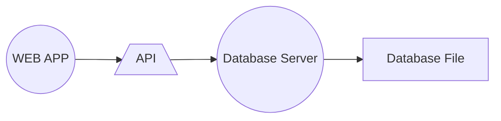
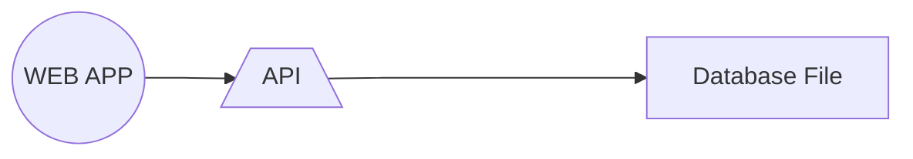

## Database Servers
- Most websites will utilise a database server. By running the database server as a separate process allows the system to scale.
- For example, the database server can be assigned to a different core, processor, or machine, or even be distributed across several machines.
- Most databases operate this way including: MySQL, Oracle, Postgres

## API-based Database
- In contrast to a database server, an API-based database doesn't run as a separate process.
- Instead, the database functions run within the same application that is calling them. This can have serious concurrency implications in terms of performance.
- However, an API-based database generally is simpler to configure and is often used for development purposes.
- An example of an API-based database is `SQLite`.
- The following diagrams show the difference between the two approaches.
### Database Server (e.q. MySQL)

### API-based Database (e.q. SQLite)

## DBMS Accounts (e.g. MySQL)
- `MySQL` requires user accounts to interact with the database.
- The application will require the `username` and `password` to be stored within the source code.
- `SQLite` doesn't have user accounts since there is no server to log into.

## Database Files
- The location of `MySQL` database files are determined by the database server which can be used to access multiple databases.
- `SQLite`, on the other hand, stores each separate database in a separate file and these files can be stored in separate locations

## Connecting
- Connecting to a MySQL server requires the following information:
  * domain name or IP address of the server
  * Username
  * Password
  * database name to open
- Connecting to an SQLite server simply requires the path of the database file.