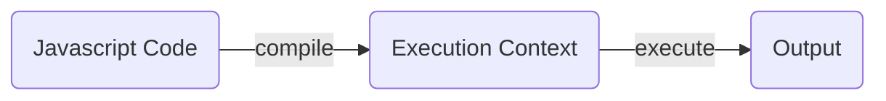
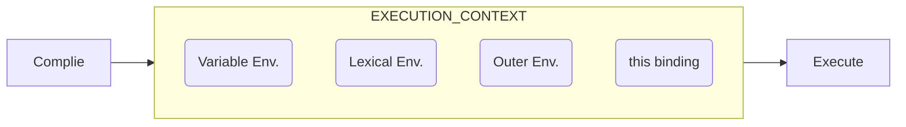

Understanding JavaScript can often feel like untagling a ball of wool, especially with peculiar concept such as `hoisting`, `closures`, and the ubiquitous `this`. However, diving depp into how JavaScript works, especially its execution context, can provide clarity.

## Comppilation and Execution

When you run JavaScript, two primary processes occur:

1. **Compliation**: Before anything gets executed, JavaScript Engine scans the entire code. This phase involves setting up memory for variables and functions.
2. **Execution**: After compilation, JavaScript runs the code line-by-line, and assign values and execute functions.



## Execution Context

The execution context, which gets created during the compilation phase, is essential to grasp. It main consists of:



## Variable Environment and Hoisting

```js title="Sample Code"
console.log(apple); //Output: undefined
var apple = 10;
```

At the compilation phase, a variable `apple` is declared and set to `undefined` in the variable environment. The actual assignment(`apple = 10`) only happens during the execution phase. Hence the console logs `undefined`. This phenomenon, where variable and function declarations are lifted to the top of their containing scope, is referred to as `hoisting`.

However, from the execution context's perspective, no actual "lifting" happens. The variable was already declared during the compilation phase. So, the term "hoisting" is more of a figurative description

### Functions & Hoisting

Things get a bit nuanced with functions. Consider:

```javascript
console.log(showName); // Output: undefined
var showName = function () {
  console.log('Hey, show a number');
};
```

Here, during compilation, `showName` is set to `undefined` since the function is assigned as an expression. Thus, the console logs `undefined`, and if you try to invoke `showName`, it will throw an error as it's not yet a function.

Interestingly, **if there's a function declaration (not expression)** with the same name as a variable, the function takes precedence during compilation.

### Edge Cases

1. **Naming Conflict**: If a function and a variable have the same name, the variable won't override the function during compilation. Always ensure unique naming to avoid unexpected behaviors.
2. **Conditional Declarations**: Even if a variable is declared inside an `if` block that never runs, during compilation, the variable is still hoisted and set to `undefined`.

```javascript
if (false) {
  var apple = 10;
}
console.log(apple); // Output: undefined
```

Despite the condition being false, apple is declared and the console logs undefined.
