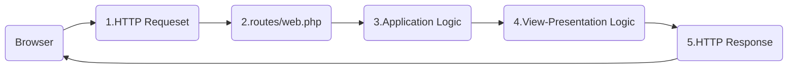

## Laravel Views



The diagram above shows the ideal flow from browser request to response. The application logic should be separated from the presentation logic which is contained in the view. Ideally, the application logic should result in data which is transferred to the view to be 'displayed' by embedding within template HTML.

- `Application Logic` -> `Creating data`
- `Presentation Logic` -> `Displaying data`

Views are contained within the `/resources/views` directory. The `welcome.blade.php` is the view file that is displayed on a newly created Laravel project. It contains mostly HTML with some `blade code - template language`. A view file can be purely HTML defined in a `*.php` file, or it can be a `*.blade.php` file.

## Returning a view

Routes can return a view using the `View` class. The default route returns the `welcome.blade.php` view:

```php
Route::get('/', function(){
  return view('welcome');
});
```

## `view()`

The `view()` function is a helper function that retrieves a view instance. The view name does not include the file extension (e.g. `*.blade.php`). Laravel will look for the view file in the views directory.
:::tip

You may want to place views in subdirectories to keep them organised. When making the view simply specify the subdirectory first, note that either `/` or `.` can be used as the path separated, e.g. either of the following will work:

```php
return view('hello/hello');
//or
return view('hello.hello');
```

The above example will load the file: views/hello/hello.php

:::

## `view()` parameters

Variables can be passed to Views several ways. Variables can be passed using a map:

```php
view('hello', array('name' =>$name));
```

Variables can also be passed using the with() function:

```php
view('hello')->with('name', $name);
```

:::info

The functions are chained, the `with()` function is called on the result of the view() function, this is a functional programming technique, which makes the code more readable.

:::

:::tip
Using PHP magic methods:

```php
view('hello')->withName($name)
```

Magic methods don't actually exist. In the above example there is no method defined withName().

The `__call()` method will be called if a method is called on an object and the method doesn't exist in PHP language.

The `__call()` method can then interpret the method name and handle it. This is how Laravel processes `with*()` magic methods. **The letters following `with` in the method name will be the variable name Laravel will use to pass the data to the view**.

In the above example, it is `name` (it will lowercase the first letter of the variable name).

The variable can now be accessed within the PHP file. However, instead of using PHP as a templating language, Laravel includes its own language called Blade.

:::
